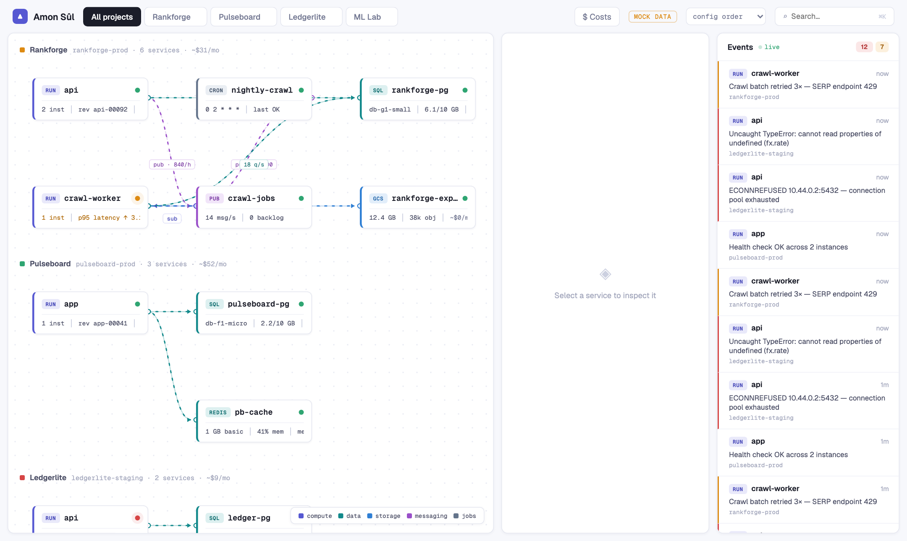
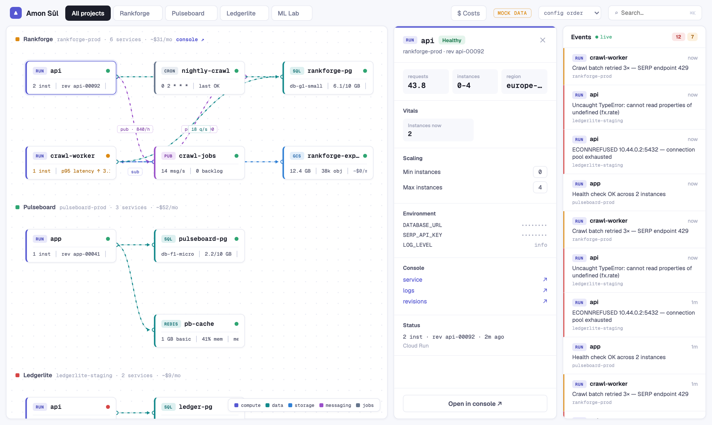
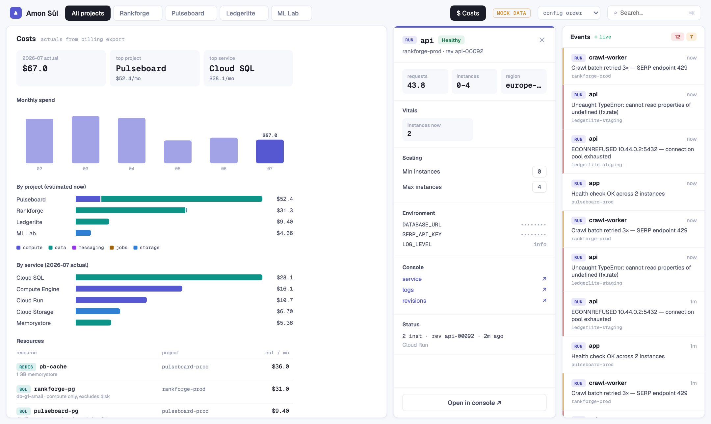

# Amon Sûl

**A self-hostable watchtower for your GCP fleet.** One dark screen showing every
project you care about as a board of connected resource nodes — Cloud Run
services, Cloud SQL instances, Pub/Sub topics, buckets, scheduler jobs,
Memorystore, VMs — with live status, recent errors from Cloud Logging, metrics
sparklines, and deep links into the GCP console.

Read-only by design: Amon Sûl watches, it does not touch.

> _Named after the watchtower of Amon Sûl on Weathertop, where a palantír kept
> watch over the realm._



|  |  |
| :----------------------------------------------------------------------------------------------------------------------------------------------------: | :----------------------------------------------------------------------------------------------------------------------------------: |
|                                                            Resource detail with live vitals                                                            |                                                            Cost breakdown                                                            |

## Quickstart (no GCP needed)

```bash
git clone https://github.com/ondrejromancov/amon-sul.git
cd amon-sul
npm install
npm run dev
```

Open http://localhost:5173 — with no config file present, Amon Sûl runs in
**mock mode** with a demo fleet, so you can explore the UI immediately.

## Watching your own projects

1. **Authenticate** with Application Default Credentials:

   ```bash
   gcloud auth application-default login
   ```

2. **Configure** — copy the example and point it at your projects:

   ```bash
   cp amon-sul.config.example.yaml amon-sul.config.yaml
   ```

   ```yaml
   projects:
     - id: my-project-prod
       name: My Project
       edges: # optional wiring drawn between nodes
         - [run/api, sql/my-db]
       layout: # optional [column, row] pins
         run/api: [0, 0]
   ```

   Resources are **auto-discovered** — only the wiring between them is yours
   to declare, using `<type>/<name>` keys (`run | sql | pubsub | storage |
scheduler | redis | vm`).

3. `npm run dev` again — the server now polls GCP (resources every 60s,
   Cloud Logging events every 30s) and streams updates to the UI over SSE.

Set `AMON_SUL_MOCK=1` to force mock mode, `AMON_SUL_CONFIG` to use a different
config path, and `PORT` to move the API off 8787.

## Self-hosting

```bash
docker build -t amon-sul .
docker run -p 8080:8080 -v $PWD/amon-sul.config.yaml:/app/amon-sul.config.yaml amon-sul
```

See [docs/self-hosting.md](docs/self-hosting.md) for required IAM roles and a
Cloud Run deployment recipe.

### Authentication

By default, Amon Sûl does not require dashboard authentication. For public or
shared networks, keep it behind Cloud Run IAM/IAP, a VPN, or a private network.

Set `AMON_SUL_TOKEN` to enable the built-in token gate. Browser users can submit
the token through the built-in form, which stores it in an `HttpOnly`,
`SameSite=Lax` cookie for the dashboard and SSE stream. API callers can also
use `Authorization: Bearer <token>`, or pass `?token=<token>` on a GET request
to set the cookie.

Write actions are off by default to preserve the read-only contract. Set
`AMON_SUL_ALLOW_WRITES=1` to enable VM start/stop, Cloud Run min-instances
updates, and Cloud Scheduler pause/resume; pair it with `AMON_SUL_TOKEN` and
the least-privilege IAM roles listed in [self-hosting](docs/self-hosting.md).

## Development

```bash
npm run dev        # server (tsx watch) + web (vite) together
npm run test       # vitest across workspaces
npm run typecheck
npm run build
```

Monorepo layout: `apps/web` (Vite + React), `apps/server` (Fastify + poller +
GCP collectors), `packages/shared` (domain types). Design docs live in
`docs/superpowers/specs/`.

## License

MIT
